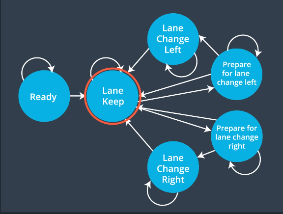

# Udacity Self Driving Car ND Path Planning Project
## Self-Driving Car Engineer Nanodegree Program

Source code for this project can be found at: https://github.com/rjlutz/CarND-Path-Planning-Project

This project was created in fulfillment of Udacity's CarND Path Planning project. The template 
project was forked from https://github.com/udacity/CarND-Path-Planning-Project and improved to meet
the specification set forth in the course materials.

---

The following specifications have been met and are demonstrated when running the simulation:


* **The car is able to drive at least 4.32 miles, without incident.**
* **The car drives according to the speed limit.** The car doesn't drive faster than the speed limit. Also the car isn't driving much slower than speed limit unless obstructed by traffic. The code implements a notion of a speed governor. The governor is adjusted to the maximum speed with open road ahead and is limited when following closely behind a slower vehicle.
* **Max acceleration and jerk are not exceeded.** The car does not exceed a total acceleration of 10 m/s^2 and a jerk of 10 m/s^3.
* **Car does not have collisions.**
The car must not come into contact with any of the other cars on the road.
* **The car stays in its lane, except for the time between changing lanes.** The car doesn't spend more than a 3 second length out side the lane lanes during changing lanes, and every other time the car stays inside one of the 3 lanes on the right hand side of the road.
* **The car is able to change lanes.** The car is able to smoothly change lanes when it makes sense to do so, such as when behind a slower moving car and an adjacent lane is clear of other traffic.

## Demonstration 
[Final Video](https://www.dropbox.com/s/c0a89442iq9gcbj/pathplanning.mp4?dl=0 "Demo Video")

# Finite State Machine Model

The path planner implements the following state machine: 



The model is amended slightly to remove the ***Ready*** state. The model starts in the ***Keep Lane (KL)*** state.
The code that implements this model is:

```
  vector<string> BehaviorPlanner::successor_states() {
   /*
   Provides the possible next states given the current state.
   */
     vector<string> states;
    string state = this->state;
    if(state.compare("KL") == 0) {
      states.push_back("KL"); // add KL first, significant if there's a tie
    states.push_back("PLCL");
    states.push_back("PLCR");
  } else if (state.compare("PLCL") == 0) {
    states.push_back("KL");
    states.push_back("LCL");
    states.push_back("PLCL");
  } else if (state.compare("PLCR") == 0) {
    states.push_back("KL");
    states.push_back("LCR");
    states.push_back("PLCR");
  } else if (state.compare("LCL") == 0) {
    states.push_back("KL");
    states.push_back("LCL");
  } else if (state.compare("LCR") == 0) {
    states.push_back("KL");
    states.push_back("LCR");
  }
  return states;
}
````

The specification was provided in the lectures for the Path Planning Module in Term 3.


# Model Generation
The in-lane and lane change paths are generated following the algorithm provided in the walkthrough video from David Silver and Aaron Brown. Several adjustments to that algorithm were required to make the simulation run successfully without incident:

* cold start condition added to bootstrap path generation with an initial direction vector, based on the cars direction as specified by the simulator.
* length of generated points reduced from 30m to 15m to improve lane tracking

The source can be viewed in BehaviorPlanner,cpp lines 410 - 511. 

# Cost Functions

Three cost functions are employed to implement the vehicle's path planning behavior:

**Safety Cost** Flags any state changes that would be dangerous. 

**Inefficiency Cost** Calculates a cost that penalizes low velocity and lane changes where cars are nearby in the target lane.

**Tie Breaker Cost** Favors faster lanes when multiple lane change options exist.

The costs are assembled in two ways. First, the inefficiency cost and tie-breaker cost are weighted and summed to create one overall weighted total. Additionally, the safety cost is evaluated and overrides the weighted sum if an unsafe state is encountered. 
## Future Improvements

Two opportunities exist for improvement:

**Speed Setting** Although the code works as-is, the speed management can be a bit choppy when following another vehicle. Implementing a PID or MPC controller would improve this situation.

**Jerk Minimization Function (JMF)** Also realting to speed managment, a JMF could be implement to eliminate the chppiness and imcrove the comfort to a user. 

